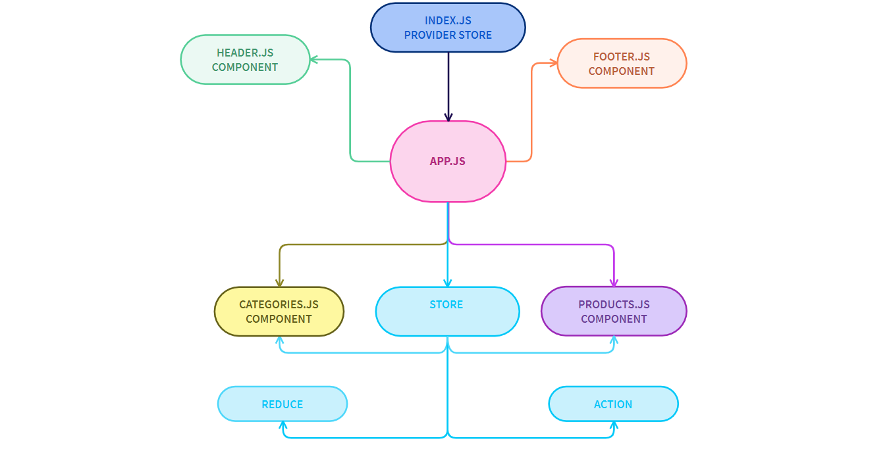

# **StoreFront APP**

### **Author: mostafa jdeitawi **

## **Redux**

### **LAB - 36**

## **Phase 1 Requirements** : 

Today, we begin the first of a 4-Phase build of the storefront application, written in React. In this first phase, our goal is to setup the basic scaffolding of the application with initial styling and basic behaviors. This initial build sets up the file structure and state management so that we can progressively build this application in a scalable manner
The following user/developer stories detail the major functionality for this phase of the project.
* As a user, I expect to see a list of available product categories in the store so that I can easily browse products
* As a user, I want to choose a category and see a list of all available products matching that category
* As a user, I want a clean, easy to use user interface so that I can shop the online store with confidence

### **Installation**
* **dependencies :**
  *  "@testing-library/jest-dom"
  *  "@testing-library/react"
  *  "@testing-library/user-event"
  *  "react"
  *  "react-dom"
  *  "react-router-dom"
  *  "react-scripts"
  *  "web-vitals"
  *  "react-bootstrap"
  *  "redux"
  *  "react-redux"
  *  "redux-devtools-extension"
  
  
### **Running the app** : 

* **npm start**
        

### UML DIAGRAM : 

### deployment : 

[deplyment link](https://pensive-borg-6365dd.netlify.app/)

## **Combined Reducers**

### **LAB - 37**

## **Phase 2 Requirements** : 

In phase 2, we will be adding the "Add to Cart" feature to our application, which will allow our users to not only browse items in the store, but also select them and have them persist in their "shopping cart" for later purchase.
The user stories from Phase 1 remain unchanged. For this phase, we are now adding the following new user stories to meet the new requirements.
* As a user, I want to choose from products in the list and add them to my shopping cart
* As a user, I want to see the products that I've added to my shopping cart so that
* As a user, I want to change the quantity of items I intend to purchase in my shopping cart
* As a user, I want to be able to remove an item from my shopping cart
* 
Application Flow:

* User sees a list of categories
* Chooses a category and sees a list of products
* Clicks the "Add to Cart" button on any product
* Clicks the "Cart" link in the header
* Sees a list of all products in the cart
* Clicks the delete button on an item and sees the item removed
* Changes the quantity selector on an item and sees the cart total change

## **thunk branch**

### **LAB - 38**

## **Phase 3 Requirements** : 

In phase 3, we will be connecting our Virtual Store to a live API so that our data is persistent and able to be separately managed.
The user stories from Phases 1 and 2 remain unchanged. For this phase, we are now adding the following new user stories to meet the new requirements.
* As a user, I want to interact with live inventory so that I have confidence that the displayed products are in stock
* As a user, I want to know to that when I add an item to my cart, that it is removed from inventory so that no other users can purchase it

### **Installation**
* **dependencies :**
  *  "superagent"
  *  "redux-thunk"

